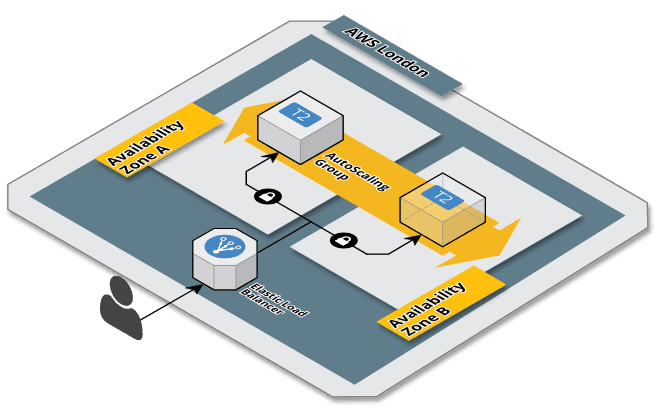

# terraform-aws-demo
Terraform-related code to create ASG in AWS supporting enmilocalfunciona.io blog entry.

# What is this?

This is the terraform code that backs up the blog [entry](http://enmilocalfunciona.io/infraestructura-como-codigo-iii-terrafom-y-aws/).



## Requirements
- Terraform 0.9.4+, install [here](https://www.terraform.io/downloads.html)
- AWS access configured via IAM role or aws_access_key_id, aws_secret_access_key credentials

## Usage

Inititialise terraform dependencies
```sh
$ terraform init
```
Check status
```sh
$ terraform plan 
```

Build infrastructure

```sh
$ terraform apply
```
Build infrastructure scaling up to 6 instances

```sh
$ terraform apply -var asg_desired=6
```

Destroy infrastructure

```sh
$ terraform destroy
```